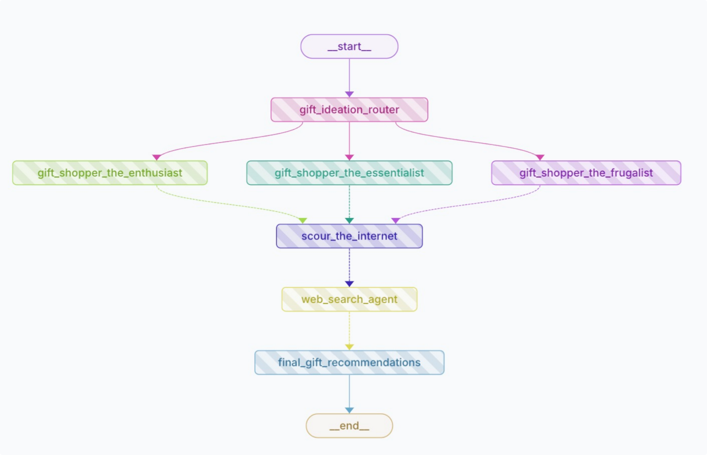

# Gift Ideas AI Multi Agent

This repo demonstrates building a Gift Ideas AI Multi Agent to perform tasks such as retrieving gift ideas from various sources via REST APIs, using LangGraph to define workflows.



## Run the code locally

```
make run
```

---
> _Code Disclaimer:_ The code provided in this repo is for educational and informational purposes only. While every effort is made to ensure the code is functional and accurate, it is provided "as-is" without any guarantees. Use the code at your own risk. The author is not responsible for any damage or data loss caused by implementing the code. Always review and test code in a safe environment before using it in production.
